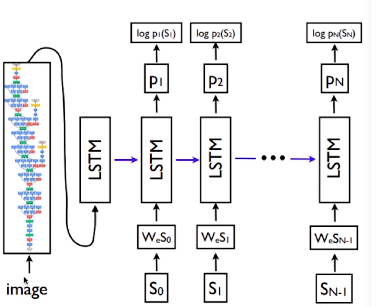
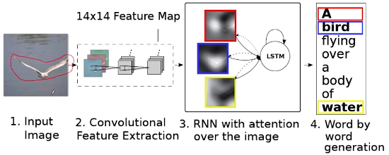
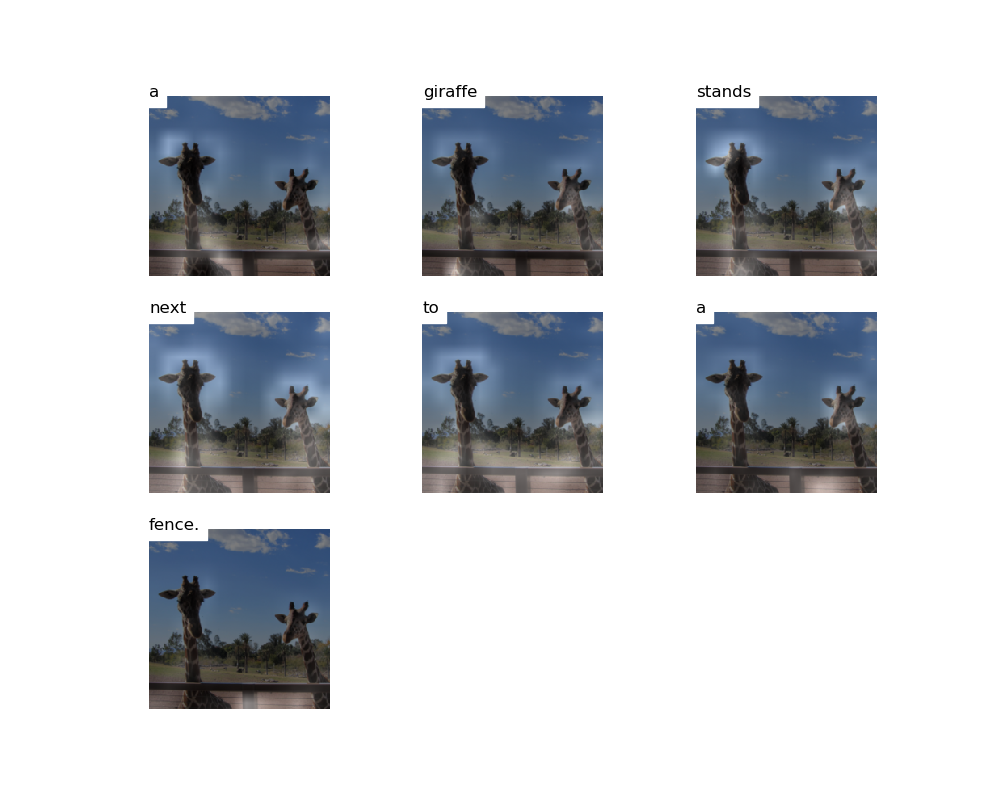
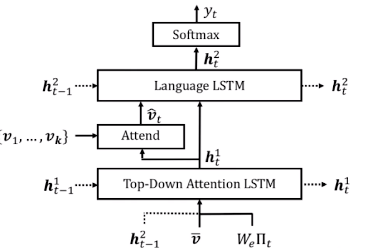

# 图像生成文本

## 核心
将图片转化为distributed representation，由序列模型解码。demo ipynb文件是show and tell，py文件是Show Attend and Tell。

## 评测指标
- BLEU(加入短句惩罚、修正1-gram计算方法)
- 人工评测

## MODEL
### Multi-Model RNN
  
multi指：1，来自转化word embedding；2，来自RNN抽象word embedding之后的结果；3，来自图像CNN（如Alexnet）抽取的信息（CNN中某fc层的输出）。作为softmax预测下一个词的输入。

### Show and Tell
  
图像特征只用一次，使用GoogleNet等较大网络编码，作为LSTM输入，decode过程类似翻译的decode过程。[code]

### Show Attend and Tell
  
加入了Attention机制。

- 前两个模型中输入是fc层的，而这个模型采用卷积层输出作为lstm的输入，卷积包含的某个视野域内的信息得以提取。（feature map与lstm输出间的attention）

- 提取将多个通道的相同位置的值concat成一个向量，成为一个包含多channel特征的tensor。

- 输入时，按照feature map每个不同像素点，将每个feature点位置的tensor加权求和，作为lstm的输入（变化的量）

存在问题：

> attention权重的学习（反向传播），需要LSTM上一个step的参数，会学习到这一部分的信息。文本生成学习也需要lstm学习信息。这就可能导致一个lstm过载，学习效果变差。

### Top-Down Bottom-Up Attention
  
双层LSTM：
- 第一层只关注attention学习，第二层学习文本生成
- 第一层输入图像均值feature，当前词的embedding和前一时刻第二层的输出的hidden state。
- attention计算第一层输出hidden state和图像不同位置的feature编码的关系。
- 第二层将图像weighted feature和第一层的hidden state作为输入。

这可以解决了 Show Attend and Tell的过载问题。

那么，文本生成图像呢？>>> GAN
